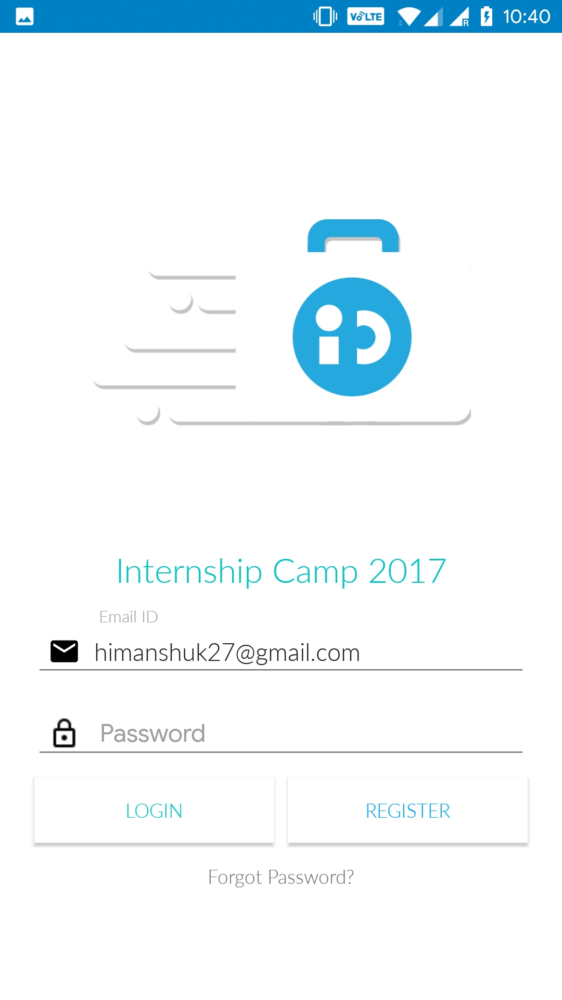
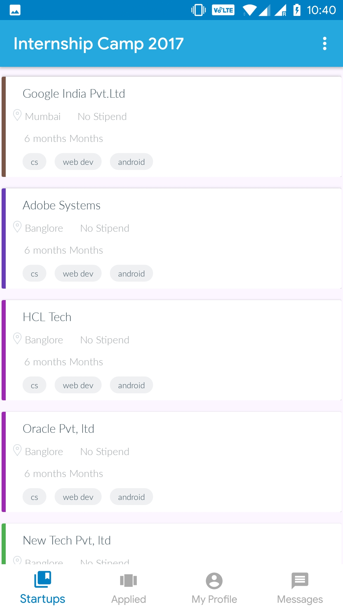
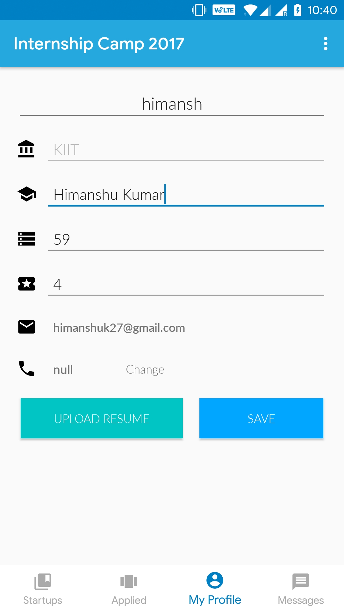
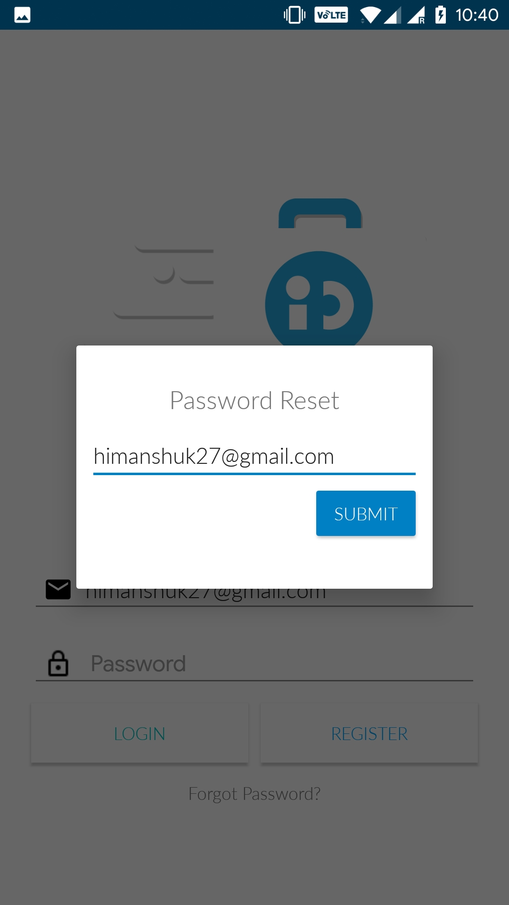

# Internship Camp 2017

An elegantly designed android app developed for the KIIT Internship Camp '17, it features social media login, user profile updation with resume upload, real-time company stats card, push notifications for alerts, instamojo 256 bit secured payment gateway, all interaction with custom php apis hosted on aws servers.	

## ScreenShots

 
 	

#### [Download APK](https://himanshu.cloud/demo/ic17_android.apk)

## Reflection 

This is a very intersting android project developed for KIIT Internship Camp 2017 (http://interncamp.ecell.org.in). Based on android and written in java this highly sophisticated app serves many functions.

#### Some of the useful features:-
	-Gmail authentication
	-Push notifications
	-Resume file upload
	-mobile no verification by Digits, fabroc
	-Instamojo payment portal
	-User Profile Edit
	-Password reset by mobile and email
Some of the technologies used in this project are java, xml, php, mysql, Digits by fabric, Instamojo, Firebase messaging
